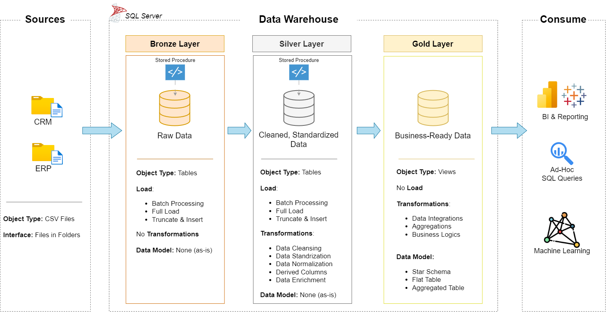

# Data Warehouse and Analytics Project

Welcome to the **Data Warehouse and Analytics Project** repository! 🚀  
This repository contains a complete end-to-end data solution covering data engineering, data modeling, exploratory data analysis (EDA), and advanced business analytics. The project showcases the full workflow from raw data ingestion to actionable insights.

---
## 🏗️ Data Architecture

The data architecture for this project follows Medallion Architecture **Bronze**, **Silver**, and **Gold** layers:


1. **Bronze Layer**: Stores raw data as received from ERP and CRM source files. Data is ingested from CSV files into a PostgreSQL database using full-load ingestion.
2. **Silver Layer**: Processes and standardizes the Bronze data. Includes data cleansing, normalization, enrichment, duplicate handling, data type corrections, and business rule transformations.
3. **Gold Layer**: Contains business-ready data structured as fact and dimension tables. This layer is optimized for analytics, reporting, and dashboards.

---
## 📖 Project Overview

This project involves:

1. **Data Architecture**: Designing a Modern Data Warehouse Using Medallion Architecture **Bronze**, **Silver**, and **Gold** layers.
2. **ETL Pipelines**: Extracting, transforming, and loading data from source systems into the warehouse.
3. **Data Modeling**: Developing fact and dimension tables optimized for analytical queries.
4. **Analytics & Reporting**: Performing EDA and creating SQL-based reports on the Gold layer (fact and dimension tables) to generate actionable business insights.

This repository demonstrates:

1. **Data Engineering**  
   Building a modern data warehouse using PostgreSQL, including ETL pipelines for extraction, cleansing, transformation, and loading.

2. **Data Modeling**  
   Designing fact and dimension tables following star schema principles.

3. **Exploratory Data Analysis (EDA)**  
   Performing dimension exploration, date analysis, measure exploration, ranking analysis, and magnitude analysis using the Gold layer.

4. **Advanced Data Analytics (ADA)**  
   Implementing business intelligence techniques such as change-over-time analysis, cumulative analysis, performance analysis, part-to-whole analysis, segmentation, and producing customer and product analytical reports.

🎯 This repository is an excellent resource for professionals and students looking to showcase expertise in:
- SQL Development
- Data Architecture
- Data Engineering  
- ETL Pipeline Developer  
- Data Modeling  
- Data Analytics

---

## 🚀 Project Requirements

### Building the Data Warehouse (Data Engineering)

#### Objective
Develop a modern data warehouse using PostgreSQL to consolidate sales data, enabling analytical reporting and informed decision-making.

#### Specifications
- **Data Sources**: Import data from two source systems (ERP and CRM) provided as CSV files.
- **Data Quality**: Cleanse and resolve data quality issues prior to analysis.
- **Integration**: Combine both sources into a single, user-friendly data model designed for analytical queries.
- **Scope**: Focus on the latest dataset only; historization of data is not required.
- **Documentation**: Provide clear documentation of the data model to support both business stakeholders and analytics teams.

---

### BI: Analytics & Reporting (Data Analysis)

#### Objective
Develop SQL-based analytics to deliver detailed insights into:
- **Customer Behavior**
- **Product Performance**
- **Sales Trends**

These insights empower stakeholders with key business metrics, enabling strategic decision-making.  

For more details, refer to [docs/requirements.md](docs/requirements.md).

## 📂 Repository Structure
```
data-warehouse-project/
│
├── datasets/                           # Raw datasets used for the project (ERP and CRM data)
│
├── docs/                               # Project documentation and architecture details
│   ├── etl.drawio                      # Draw.io file showing different techniques and methods of ETL
│   ├── data_architecture.drawio        # Draw.io file shows the project's architecture
│   ├── data_catalog.md                 # Catalog of datasets, including field descriptions and metadata
│   ├── data_flow.drawio                # Draw.io file for the data flow diagram
│   ├── data_models.drawio              # Draw.io file for data models (star schema)
│   ├── naming-conventions.md           # Consistent naming guidelines for tables, columns, and files
│
├── scripts/                            # SQL scripts for ETL and transformations
│   ├── bronze/                         # Scripts for extracting and loading raw data
│   ├── silver/                         # Scripts for cleaning and transforming data
│   ├── gold/                           # Scripts for creating analytical models
│   ├── eda_analysis/ # SQL queries for EDA
│   ├── advanced_analytics/ # SQL scripts for advanced analytics and reporting
│
├── tests/                              # Data quality checks, validation queries, and test scripts
│
├── README.md                           # Project overview and instructions
└── LICENSE                             # License information for the repository                 
```
